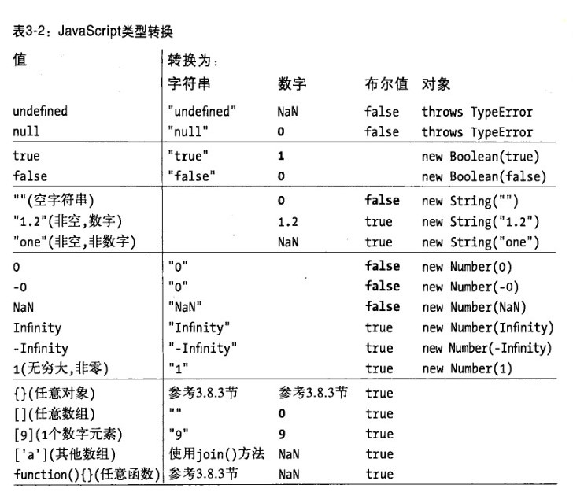

######《JS权威指南》第三章 & 《深入理解JS》第八章

《JS权威指南》第3章：类型、值和变量  
JS的数据类型分为两类（原始类型和对象类型）  
- 3.1 数字  
    - 整型直接量  
    - 浮点型直接量  
    - 算术运算  
    - 二进制浮点数和四舍五入错误  
    - 日期和时间  
- 3.2 文本  
    - 字符串直接量
    - 转义字符
    - 字符串的使用
```
    var s = "hello,world" //定义字符串
    s.charAt(0) //"h" 第一个字符
    s.charAt(s.length-1) //"d" 最后一个字符
    s.subString(1,4) //"ell" 第2-4个字符
    s.slice(1,4) //同上
    s.slice(-3) //"rld" 最后三个字符
    s.indexOf("l") //2 字符l首次出现的位置
    s.lastIndexOf("l") //10 字符l最后一次出现的位置
    s.indexOf("l",3) //3 在位置3之后首次出现字符l的位置
    s.split(",") //["hello","world"]分割成子串
    s.replace("h","H") //"Hello,world" 全文字符替换
    s.toUpperCase() //"HELLO,WORLD"
```
- 3.3 布尔值
- 3.4 null和undefined
- 3.5 全局对象
- 3.6 包装对象
    - 一旦当属性引用结束，这个新创建的对象就会销毁  
    - 是个临时对象  
    - "==" 视为相等
    - "==="视为不等
- 3.7 不可变的原始值和可变的对象引用
- 3.8 类型转换
    - 

《深入理解JS》第八章  值


    

